# Windows 10 with MS Excel (Office 365) and PostgreSQL 11

This short HOWTO explains the steps to connect MS Excel 2016 to a PostgreSQL database.

At the time of writing, the PostgreSQL database was running version 11.1 in a Docker container (outside the scope of this HOWTO).

To follow this HOWTO you will need a PostgreSQL server to connect to. The examples shown are based on the [DVD Rental](http://www.postgresqltutorial.com/postgresql-sample-database/) sample database.

## Installing Required Software

Assuming Windows 10 is already installed, you need to install the following additional software:

* [Microsoft Office 365](https://www.office.com/) - follow the instructions as per Microsoft. __Note__: Registration required.
* [PostgreSQL ODBC Drivers](https://odbc.postgresql.org/) for Windows

### Installing the ODBC Drivers

1. [Download the 32bit drivers](https://ftp.postgresql.org/pub/odbc/versions/msi/psqlodbc_11_00_0000-x86.zip). __Note__: The 64bit driver will not work with MS Excel, which is only a 32bit application!
2. Unzip in a convenient location on your local machine
3. Navigate into the unzipped folder and run the installer

## Configuring the ODBC Data Source

Windows 10 ships with ODBC utilities. Follow these simple instructions:

| Step # | Screenshot                                        | Description                                                                                                |
|--------|---------------------------------------------------|------------------------------------------------------------------------------------------------------------|
|      1 | 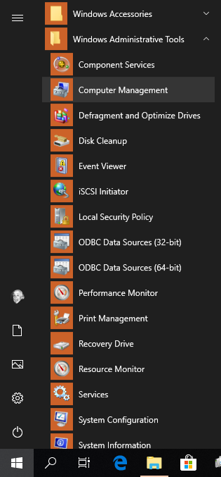    | On the Start page, type "__ODBC Data Sources__" (without the quotes)                                       |
|      2 | 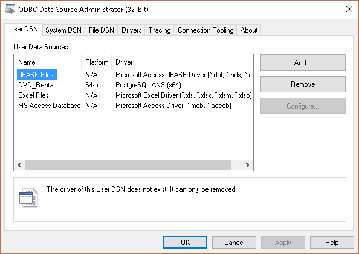      | On the "Use DSN" Tab, click the "Add..." button                                                            |
|      3 | 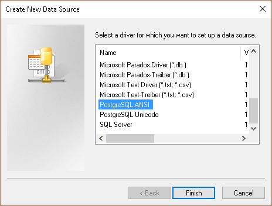      | Select "PostgreSQL ANSI"                                                                                   |
|      4 | 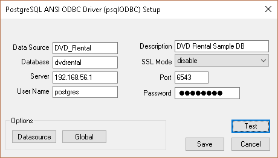      | On the next window, enter the database connections details. Use the "Test" button to test your connection! |
|      5 | 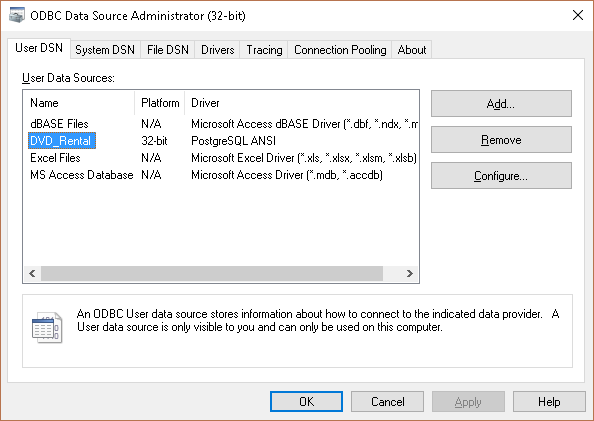      | Once done, you should see the new data source is now available                                             |

## Connecting to the Data Source in MS Excel 2016

| Step # | Screenshot                                  | Description                                                                                                                                                                                   |
|--------|---------------------------------------------|-----------------------------------------------------------------------------------------------------------------------------------------------------------------------------------------------|
|      1 | 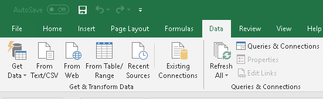  | Assuming you have opened MS Excel, navigate to the "Data" tab and click on "Existing Connections"                                                                                             |
|      2 | 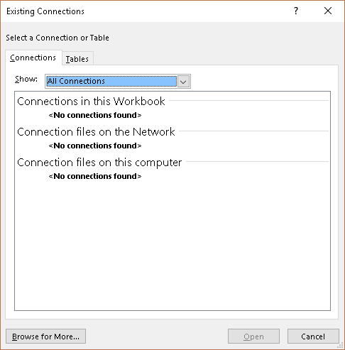  | In the open dialog box, click on "Browse for more..." button (bottom left corner)                                                                                                             |
|      3 | 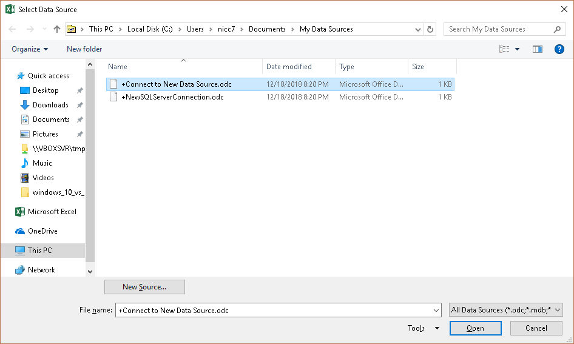  | In the next dialog, open the "Connect to New Data Source.odc" option.                                                                                                                         |
|      4 | 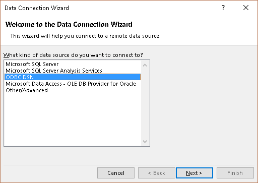  | In the next dialog box select "ODBC DSN" and click the "Next" button                                                                                                                          |
|      5 | 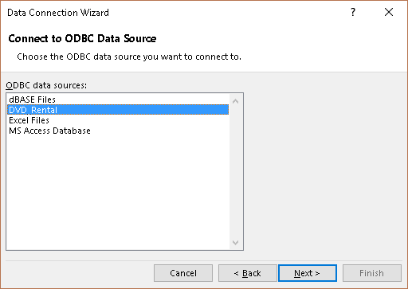  | Now select your "DVD_Rental" database (depending on what you named it), and click "Next"                                                                                                      |
|      6 | 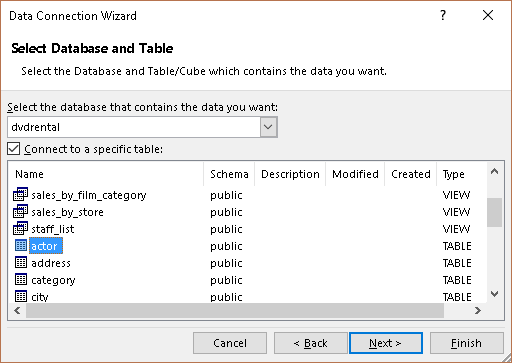  | Select a table you whish to connect to, for example "actor", and click "Next"                                                                                                                 |
|      7 | 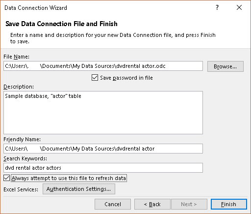  | Select where you want to save the data source details. __WARNING__: Saving your database credentials may pose a risk. Use with caution and in accordance with your company security policies! |
|      8 | 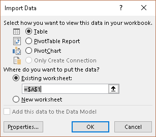  | Once you click the "Finish" button, you will now have to select how you want to import the data - this choice is up to you! Experiment!                                                       |
|      9 | 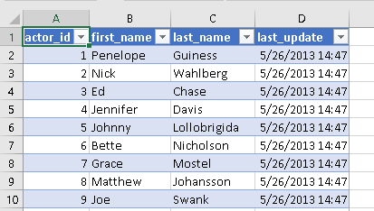  | Your data is now imported and linked!                                                                                                                                                         |

## Conclusion

This was a very quick HOWTO that walked through the steps of connecting MS Excel 365 running on Windows 10 to a PostgreSQL 11.1 Database (using a sample database).

